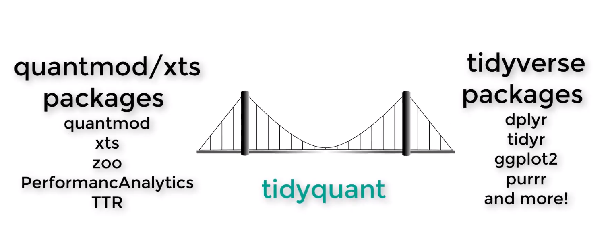
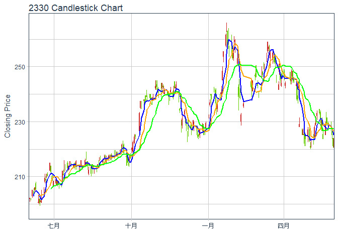

------------------------------------------------------------------------

前言
----

R語言在財務領域中，常用到的套件大概有下列幾個：

-   [xts](https://cran.r-project.org/web/packages/xts/xts.pdf)/[zoo](https://cran.r-project.org/web/packages/zoo/zoo.pdf): 處理時間序列之套件。
-   [TTR](https://cran.r-project.org/web/packages/TTR/TTR.pdf): 計算金融資產技術指標之套件。
-   [quantmod](https://cran.r-project.org/web/packages/quantmod/quantmod.pdf): 金融資產技術分析回測套件，可至[Yahoo Finance](https://finance.yahoo.com/)或[Google Finance](https://finance.google.com/)下載歷史股價數據。並且整合`TTR`套件，繪製出漂亮的技術分析圖析。
-   [PerformanceAnalytics](https://cran.r-project.org/web/packages/PerformanceAnalytics/PerformanceAnalytics.pdf): 計算金融資產報酬績效指標之套件。

現在的R語言在資料科學的浪潮之下，資料數據格式已走向[tidy data](https://cran.r-project.org/web/packages/tidyr/vignettes/tidy-data.html)形式。[tidyverse](https://www.tidyverse.org/)套件已是每位R使用者必學的套件，使用此套件讓資料整理的程式碼簡潔又快速，讓R語言的方便性邁向更高一層。然而在財務領域的套件，目前皆是以時間序列資料格式(xts)為基礎建構而成。意即要使用這些套件的函數時，需要先將資料先轉為xts格式，才能做財務分析。若要在`tidyverse`套件中使用這些財務領域套件的函數，會有許多限制，需要做額外的整理才能使用，非常不方便。

針對這個痛點，R語言有人站出來解決這個問題，Matt Dancho和Davis Vaughan開發出[tidyquant](https://cran.r-project.org/web/packages/tidyquant/tidyquant.pdf)套件，為財務領域套件與`tidyverse`套件搭起一座橋梁，讓`tidyverse`套件能夠很輕易地使用財務領域套件。


<center>
圖1 tidyquant套件示意圖
</center>
<center>
(圖片截至於tidyquant套件的[影片介紹](https://www.youtube.com/embed/woxJZTL2hok))
</center>
`tidyquant`套件的作者Matt Dancho寫出許多詳盡的說明範例檔案，可參考以下連結:

-   [Introduction to tidyquant](https://cran.r-project.org/web/packages/tidyquant/vignettes/TQ00-introduction-to-tidyquant.html)
-   [Core Functions in tidyquant](https://cran.r-project.org/web/packages/tidyquant/vignettes/TQ01-core-functions-in-tidyquant.html#get-quantitative-data)
-   [R Quantitative Analysis Package Integrations in tidyquant](https://cran.r-project.org/web/packages/tidyquant/vignettes/TQ02-quant-integrations-in-tidyquant.html)
-   [Scaling and Modeling with tidyquant](https://cran.r-project.org/web/packages/tidyquant/vignettes/TQ03-scaling-and-modeling-with-tidyquant.html)
-   [Charting with tidyquant](https://cran.r-project.org/web/packages/tidyquant/vignettes/TQ04-charting-with-tidyquant.html)
-   [Performance Analysis with tidyquant](https://cran.r-project.org/web/packages/tidyquant/vignettes/TQ05-performance-analysis-with-tidyquant.html)

當然，本篇文章的說明也都是從以上的說明範例檔案來學習並寫出來的！差別在於我們是用中文說明及臺灣的股市價格資料來做範例，並只擷取重要部分，讓大家可以快速地掌握脈絡。

------------------------------------------------------------------------

數據下載
--------

做股市分析的第一步就是要取得股價資料，`tidyquant`套件的`tq_get()`函數整合`quantmod`套件的`getSymbols()`函數。透過`tq_get()`函數可以一次下載多檔股票，並且以`tibble`格式儲存資料，讓後續的資料處理更加方便。此處示範如何下載2017/06/01至2018/05/31，鴻海(2317.TW)、台積電(2330.TW)及中華電信(2412.TW)及臺灣加權指數(^TWII)的歷史價格資料，資料下載來源為[Yahoo Finance](https://finance.yahoo.com/)。

``` r
# 載入套件
library(tidyquant)

# 下載資料
stockData <- c("^TWII", "2330.TW", "2317.TW", "2412.TW") %>%
  tq_get(get = "stock.price", from = "2017-06-01", to = "2018-05-31")

# 觀看資料
stockData
```

    ## # A tibble: 988 x 8
    ##    symbol       date     open     high      low    close  volume adjusted
    ##     <chr>     <date>    <dbl>    <dbl>    <dbl>    <dbl>   <dbl>    <dbl>
    ##  1  ^TWII 2017-06-01 10064.44 10100.37 10059.93 10087.42 1923600 10087.42
    ##  2  ^TWII 2017-06-02 10117.76 10152.53 10117.06 10152.53 2037600 10152.53
    ##  3  ^TWII 2017-06-03       NA       NA       NA       NA      NA       NA
    ##  4  ^TWII 2017-06-05 10164.89 10226.84 10164.89 10226.84 2141900 10226.84
    ##  5  ^TWII 2017-06-06 10213.17 10221.64 10190.39 10206.18 2016200 10206.18
    ##  6  ^TWII 2017-06-07 10216.14 10242.39 10183.15 10209.99 2172700 10209.99
    ##  7  ^TWII 2017-06-08 10215.93 10235.70 10211.00 10225.78 1703500 10225.78
    ##  8  ^TWII 2017-06-09 10238.55 10268.37 10198.80 10199.65 2139100 10199.65
    ##  9  ^TWII 2017-06-12 10137.04 10158.64 10109.96 10109.96 1746300 10109.96
    ## 10  ^TWII 2017-06-13 10109.70 10146.67 10109.70 10128.15 1586300 10128.15
    ## # ... with 978 more rows

簡單的兩行程式碼就可以下載多檔股票歷史數據，並整理成tibble資料格式，與`quantmod`套件的`getSymbols()`函數相比真的是方便很多。

------------------------------------------------------------------------

範例資料來源
------------

除了透過`tq_get()`函數自[Yahoo Finance](https://finance.yahoo.com/)下載資料外，也可以從外部資料庫讀入數據，整理成`tidyquant`所需要的資料格式。此處以臺灣大專院校財金系最常使用的台灣經濟新報資料庫(TEJ)為例，透過特殊轉檔功能自TEJ下載資料輸出成txt檔案，然後再用R軟體讀入數據。資料期間為2017/06/01至2018/05/31之日頻調整後股價資料。分析資產標的分別為鴻海、台積電、中華電信股票及臺灣加權指數。

``` r
# 讀取數據
stockData <- read.table("tej_data.txt", header = T, sep = "\t", stringsAsFactors = F) %>% 
  as_data_frame()

# 整理資料欄位(依序為股票代碼、名稱、日期、開盤價、最高價、最低價、收盤價、成交量及成交金額)
colnames(stockData) <- c("code", "name", "date", "open", "high", "low", "close", "volume", "tradeValue")

# 將股票代碼及名稱空白格刪除
stockData <- stockData %>%
  mutate(code = gsub("\\s+","", code),
         name = gsub("\\s+","", name))

# 觀看資料
stockData
```

    ## # A tibble: 996 x 9
    ##     code     name     date     open     high      low    close  volume
    ##    <chr>    <chr>    <int>    <dbl>    <dbl>    <dbl>    <dbl>   <int>
    ##  1  2317     鴻海 20170601    99.57   100.53    99.09   100.53   27441
    ##  2  2330   台積電 20170601   198.39   200.32   197.90   200.32   29623
    ##  3  2412   中華電 20170601   103.13   103.60   102.65   103.13   10351
    ##  4 Y9999 加權指數 20170601 10064.44 10100.37 10059.93 10087.42 3935374
    ##  5  2317     鴻海 20170602   101.01   101.49   100.53   101.49   38194
    ##  6  2330   台積電 20170602   201.77   202.26   200.81   202.26   23265
    ##  7  2412   中華電 20170602   103.13   103.60   102.17   103.13    7341
    ##  8 Y9999 加權指數 20170602 10117.76 10152.53 10117.06 10152.53 4262071
    ##  9  2317     鴻海 20170603   101.01   101.49   100.53   101.01    9968
    ## 10  2330   台積電 20170603   202.26   202.26   201.29   202.26    1535
    ## # ... with 986 more rows, and 1 more variables: tradeValue <int>

由於TEJ資料庫我們採用特殊轉檔功能輸出，因此日期是以8碼數字格式儲存。為了讓`tidyquant`套件能夠運作，需將日期欄位由數字格式轉為日期格式。

``` r
# 將8碼數字日期格式轉為日期格式
DateConvert <- function(date){
  date <- as.Date(as.character(date), "%Y%m%d")
  return(date)
}

stockData <- stockData %>% mutate(date = DateConvert(date))

# 觀看資料
stockData
```

    ## # A tibble: 996 x 9
    ##     code     name       date     open     high      low    close  volume
    ##    <chr>    <chr>     <date>    <dbl>    <dbl>    <dbl>    <dbl>   <int>
    ##  1  2317     鴻海 2017-06-01    99.57   100.53    99.09   100.53   27441
    ##  2  2330   台積電 2017-06-01   198.39   200.32   197.90   200.32   29623
    ##  3  2412   中華電 2017-06-01   103.13   103.60   102.65   103.13   10351
    ##  4 Y9999 加權指數 2017-06-01 10064.44 10100.37 10059.93 10087.42 3935374
    ##  5  2317     鴻海 2017-06-02   101.01   101.49   100.53   101.49   38194
    ##  6  2330   台積電 2017-06-02   201.77   202.26   200.81   202.26   23265
    ##  7  2412   中華電 2017-06-02   103.13   103.60   102.17   103.13    7341
    ##  8 Y9999 加權指數 2017-06-02 10117.76 10152.53 10117.06 10152.53 4262071
    ##  9  2317     鴻海 2017-06-03   101.01   101.49   100.53   101.01    9968
    ## 10  2330   台積電 2017-06-03   202.26   202.26   201.29   202.26    1535
    ## # ... with 986 more rows, and 1 more variables: tradeValue <int>

接下來我們將以此範例資料，來介紹`tidyquant`套件的函數用法。

------------------------------------------------------------------------

計算技術指標寫法示範
--------------------

此小節示範如何撰寫技術指標，主要是利用`tq_mutate()`函數，其引數依序為:

1.  data: 資料集
2.  select: 選擇計算技術指標函數會使用到的資料欄位
3.  mutate\_fun: 選擇要用的技術指標函數(`TTR`套件)
4.  技術指標函數之參數設定

透過`group_by()`函數搭配`tq_mutate()`函數以及`TTR`套件的技術指標函數，即可用簡潔的程式碼快速地計算出各支股票的技術指標值。以下為計算5日簡單移動平均線範例：

``` r
# 計算簡單移動平均線參數
stockData <- stockData %>%
  arrange(code, date) %>%         # 資料排序
  group_by(code) %>%              # 以股票代碼為群組目標
  tq_mutate(select = c(close),    # 選擇收盤價
            mutate_fun = SMA,     # 選擇簡單移動平均線
            n = 5) %>%            # 5日簡單移動平均線參數
  rename(ma5 = SMA)               # 重新命名欄位
  
# 觀看資料
stockData %>% 
  select(code, date, ma5) %>% 
  arrange(code, date)
```

    ## # A tibble: 996 x 3
    ## # Groups:   code [4]
    ##     code       date     ma5
    ##    <chr>     <date>   <dbl>
    ##  1  2317 2017-06-01      NA
    ##  2  2317 2017-06-02      NA
    ##  3  2317 2017-06-03      NA
    ##  4  2317 2017-06-05      NA
    ##  5  2317 2017-06-06 101.106
    ##  6  2317 2017-06-07 101.202
    ##  7  2317 2017-06-08 101.106
    ##  8  2317 2017-06-09 101.106
    ##  9  2317 2017-06-12 100.434
    ## 10  2317 2017-06-13  99.858
    ## # ... with 986 more rows

如果要再算10日及20日簡單移動平均線，則繼續向後新增`tq_mutate()`:

``` r
stockData <- stockData %>%
  
  # 計算10日簡單移動平均線參數
  tq_mutate(select = c(close),
            mutate_fun = SMA,
            n = 10) %>%
  rename(ma10 = SMA) %>%
  
  # 計算20日簡單移動平均線參數
  tq_mutate(select = c(close),
            mutate_fun = SMA,
            n = 20) %>%
  rename(ma20 = SMA)

# 觀看資料
stockData %>% 
  select(code, date, ma10:ma20) %>% 
  arrange(code, date)
```

    ## # A tibble: 996 x 4
    ## # Groups:   code [4]
    ##     code       date    ma10  ma20
    ##    <chr>     <date>   <dbl> <dbl>
    ##  1  2317 2017-06-01      NA    NA
    ##  2  2317 2017-06-02      NA    NA
    ##  3  2317 2017-06-03      NA    NA
    ##  4  2317 2017-06-05      NA    NA
    ##  5  2317 2017-06-06      NA    NA
    ##  6  2317 2017-06-07      NA    NA
    ##  7  2317 2017-06-08      NA    NA
    ##  8  2317 2017-06-09      NA    NA
    ##  9  2317 2017-06-12      NA    NA
    ## 10  2317 2017-06-13 100.482    NA
    ## # ... with 986 more rows

若要計算隨機指標，寫法為:

``` r
stockData <- stockData %>%
  
  # 計算隨機指標
  tq_mutate(select = c(high, low, close),   
            mutate_fun = stoch, 
            nFastK = 14, 
            nFastD = 3, 
            nSlowD = 3)

# 觀看資料
stockData %>% 
  select(code, date, fastK:stoch) %>% 
  arrange(code, date)
```

    ## # A tibble: 996 x 5
    ## # Groups:   code [4]
    ##     code       date fastK fastD stoch
    ##    <chr>     <date> <dbl> <dbl> <dbl>
    ##  1  2317 2017-06-01    NA    NA    NA
    ##  2  2317 2017-06-02    NA    NA    NA
    ##  3  2317 2017-06-03    NA    NA    NA
    ##  4  2317 2017-06-05    NA    NA    NA
    ##  5  2317 2017-06-06    NA    NA    NA
    ##  6  2317 2017-06-07    NA    NA    NA
    ##  7  2317 2017-06-08    NA    NA    NA
    ##  8  2317 2017-06-09    NA    NA    NA
    ##  9  2317 2017-06-12    NA    NA    NA
    ## 10  2317 2017-06-13    NA    NA    NA
    ## # ... with 986 more rows

`tq_mutate()`函數內的`nFastK`、`nFastD`及`nSlowD`引數即為原`TTR`套件`stoch()`的引數。從上面的資料表可以發現，透過`tq_mutate()`函數，可將`TTR`套件`stoch()`函數跑出的3個欄位結果(`fastK`、`fastD`及`stoch`)全部新增在`stockData`資料表內。若沒有`tq_mutate()`這個函數，用`mutate()`函數計算隨機指標會是件很麻煩的事情。

若要計算MACD指標，寫法為:

``` r
stockData <- stockData %>%

  # 計算MACD指標
  tq_mutate(select = close,                
            mutate_fun = MACD, 
            nFast = 12, 
            nSlow = 26, 
            nSig  = 9)               

# 觀看資料
stockData %>% 
  select(code, date, macd:signal) %>% 
  arrange(code, date)
```

    ## # A tibble: 996 x 4
    ## # Groups:   code [4]
    ##     code       date  macd signal
    ##    <chr>     <date> <dbl>  <dbl>
    ##  1  2317 2017-06-01    NA     NA
    ##  2  2317 2017-06-02    NA     NA
    ##  3  2317 2017-06-03    NA     NA
    ##  4  2317 2017-06-05    NA     NA
    ##  5  2317 2017-06-06    NA     NA
    ##  6  2317 2017-06-07    NA     NA
    ##  7  2317 2017-06-08    NA     NA
    ##  8  2317 2017-06-09    NA     NA
    ##  9  2317 2017-06-12    NA     NA
    ## 10  2317 2017-06-13    NA     NA
    ## # ... with 986 more rows

和隨機指標寫法架構一樣，`tq_mutate()`函數內的`nFast`、`nSlow`及`nSig`引數即為原`TTR`套件`MACD()`的引數。

------------------------------------------------------------------------

計算績效指標寫法示範
--------------------

在計算績效指標時，我們需先將各檔股票股價資料整理成報酬率資料，並額外整理出臺灣加權指數報酬率做為市場報酬率。

``` r
# 計算各資產報酬率
stockRet <- stockData %>% 
  select(code:date, close) %>%
  group_by(code) %>%
  arrange(code, date) %>%
  mutate(ret = close/lag(close)-1) %>%
  ungroup() %>%
  na.omit()

# 整理市場報酬率
mktRet <- stockRet %>% 
  filter(code == "Y9999") %>%
  select(date, ret) %>%
  rename(mktRet = ret)
  
# 整理各資產報酬率並且併入各交易日對應的市場報酬率
stockRet <- stockRet %>%
  select(code:date, ret) %>%
  filter(code != "Y9999") %>%
  left_join(mktRet, by = c("date" = "date"))
```

整理完後的資料，每個資產在每個交易日都有日報酬率和當日的市場報酬率，如下所示：

``` r
stockRet
```

    ## # A tibble: 744 x 5
    ##     code  name       date          ret        mktRet
    ##    <chr> <chr>     <date>        <dbl>         <dbl>
    ##  1  2317  鴻海 2017-06-02  0.009549388  0.0064545741
    ##  2  2317  鴻海 2017-06-03 -0.004729530  0.0005535566
    ##  3  2317  鴻海 2017-06-05  0.004752005  0.0067620581
    ##  4  2317  鴻海 2017-06-06 -0.004729530 -0.0020201744
    ##  5  2317  鴻海 2017-06-07  0.000000000  0.0003733032
    ##  6  2317  鴻海 2017-06-08  0.000000000  0.0015465245
    ##  7  2317  鴻海 2017-06-09  0.000000000 -0.0025553063
    ##  8  2317  鴻海 2017-06-12 -0.028512029 -0.0087934390
    ##  9  2317  鴻海 2017-06-13  0.000000000  0.0017992158
    ## 10  2317  鴻海 2017-06-14  0.000000000 -0.0054985363
    ## # ... with 734 more rows

接下來示範如何計算績效指標，主要是透過`tq_performance()`函數，其引數依序為:

1.  data: 資料集
2.  Ra: 資產報酬率
3.  Rb: 市場基準報酬率
4.  performance\_fun: 績效指標函數(`PerformanceAnalytics`套件)
5.  績效指標函數之參數設定

以計算常用的夏普比率為例，此處假設無風險年利率為1%，程式寫法如下。需注意的地方是，計算夏普比率時不需要用到市場報酬率，因此Rb的參數我們給NULL值。

``` r
sharpeRatio <- stockRet %>%
  group_by(code) %>%
  tq_performance(Ra = ret,
                 Rb = NULL,
                 performance_fun = SharpeRatio,
                 Rf = 0.01/252)

# 觀看資料
sharpeRatio
```

    ## # A tibble: 3 x 4
    ## # Groups:   code [3]
    ##    code `ESSharpe(Rf=0%,p=95%)` `StdDevSharpe(Rf=0%,p=95%)`
    ##   <chr>                   <dbl>                       <dbl>
    ## 1  2317             -0.02012416                 -0.03741787
    ## 2  2330              0.01323757                  0.03772705
    ## 3  2412              0.01668980                  0.03367462
    ## # ... with 1 more variables: `VaRSharpe(Rf=0%,p=95%)` <dbl>

和`tq_mutate()`函數架構一樣，`tq_performance()`函數內的`Rf`引數為原`PerformanceAnalytics`套件`SharpeRatio()`的引數。

若要跑資本資產定價模型(CAPM)，則寫法為:

``` r
capmTable <- stockRet %>%
  group_by(code) %>%
  tq_performance(Ra = ret, 
                 Rb = mktRet, 
                 performance_fun = table.CAPM,
                 Rf = 0.01/252)

# 觀看資料
capmTable
```

    ## # A tibble: 3 x 13
    ## # Groups:   code [3]
    ##    code ActivePremium  Alpha AnnualizedAlpha   Beta `Beta-` `Beta+`
    ##   <chr>         <dbl>  <dbl>           <dbl>  <dbl>   <dbl>   <dbl>
    ## 1  2317       -0.2291 -1e-03         -0.2167 1.3815  1.1093  1.5340
    ## 2  2330        0.0408  1e-04          0.0161 1.5010  1.3020  1.6403
    ## 3  2412       -0.0215  1e-04          0.0248 0.3600  0.3675  0.4613
    ## # ... with 6 more variables: Correlation <dbl>,
    ## #   `Correlationp-value` <dbl>, InformationRatio <dbl>, `R-squared` <dbl>,
    ## #   TrackingError <dbl>, TreynorRatio <dbl>

------------------------------------------------------------------------

資料頻率轉換
------------

上述計算績效指標時皆採用日頻資料，但一般常見的作法是用月頻資料來計算績效指標。在`tidyquant`套件中，使用`tq_transmute()`函數搭配原本`quantmod`套件內的`periodReturn()`函數，可以很輕易地對資料做頻率轉換。`tq_transmute()`的引數依序為:

1.  data: 資料集
2.  select: 選擇資料欄位
3.  mutate\_fun: 套件函數
4.  col\_rename: 新增的欄位名稱
5.  套件函數之參數設定

``` r
# 轉換成月頻資料
stockMonthRet <- stockData %>%
  group_by(code) %>%
  tq_transmute(select = close,
               mutate_fun = periodReturn,
               col_rename = "monthRet",
               period = "monthly")

# 觀看資料
stockMonthRet
```

    ## # A tibble: 48 x 3
    ## # Groups:   code [4]
    ##     code       date     monthRet
    ##    <chr>     <date>        <dbl>
    ##  1  2317 2017-06-30  0.119665771
    ##  2  2317 2017-07-31  0.043887704
    ##  3  2317 2017-08-31  0.000000000
    ##  4  2317 2017-09-30 -0.089361702
    ##  5  2317 2017-10-31  0.046728972
    ##  6  2317 2017-11-30 -0.107142857
    ##  7  2317 2017-12-29 -0.048000000
    ##  8  2317 2018-01-31 -0.031512605
    ##  9  2317 2018-02-27 -0.044468547
    ## 10  2317 2018-03-31  0.004540295
    ## # ... with 38 more rows

------------------------------------------------------------------------

繪製圖形
--------

`tidyquant`除了將財務領域套件與`dplyr`套件做結合外，與`ggplot2`繪圖套件也整合得相當好，接下來將會展現幾個範例。

-   繪製股價日頻走勢圖

``` r
stockData %>%
  ggplot(aes(x = date, y = close, color = code)) +
  geom_line(size = 1) +
    labs(title = "Daily Stock Prices",
         x = "", y = "Close Prices", color = "") +
    facet_wrap(~ code, ncol = 2, scales = "free_y") +
    scale_y_continuous(labels = scales::dollar) +
    theme_tq() + 
    scale_color_tq()
```


-   繪製技術分析圖形(以台積電為例)

``` r
stockData %>%
  filter(code == "2330") %>%
  ggplot(aes(x = date, y = close)) +
  geom_candlestick(aes(open = open, high = high, low = low, close = close),
                   color_up = "firebrick3", color_down = "chartreuse3", 
                   fill_up  = "firebrick3", fill_down  = "chartreuse3") +
  labs(title = "2330 Candlestick Chart", y = "Closing Price", x = "") + 
  theme_tq() +
  scale_x_date(expand = c(0, 0))
```


-   繪製技術分析圖形(以台積電為例)及5日、10日及20日均線

``` r
stockData %>%
  filter(code == "2330") %>%
  ggplot(aes(x = date, y = close)) +
  geom_candlestick(aes(open = open, high = high, low = low, close = close),
                   color_up = "firebrick3", color_down = "chartreuse3", 
                   fill_up  = "firebrick3", fill_down  = "chartreuse3") +
  geom_ma(ma_fun = SMA, n = 5, color = "blue", linetype = 7,size = 1) +
  geom_ma(ma_fun = SMA, n = 10, color = "orange", linetype = 7, size = 1) + 
  geom_ma(ma_fun = SMA, n = 20, color = "green", linetype = 7, size = 1) +
  labs(title = "2330 Candlestick Chart", y = "Closing Price", x = "") + 
  theme_tq() +
  scale_x_date(expand = c(0, 0))
```



-   繪製技術分析圖形(以台積電為例)及布林通道

``` r
stockData %>%
  filter(code == "2330") %>%
  ggplot(aes(x = date, y = close, open = open, high = high, low = low, close = close)) +
  geom_candlestick(color_up = "firebrick3", color_down = "chartreuse3", 
                   fill_up  = "firebrick3", fill_down  = "chartreuse3") +
  geom_bbands(ma_fun = SMA, sd = 2, n = 20, 
              linetype = 7, size = 1, alpha = 0.2,
              fill = palette_light()[[1]],
              color_bands = palette_light()[[1]],
              color_ma = palette_light()[[2]]) +
  labs(title = "2330 Candlestick Chart", y = "Closing Price", x = "") + 
  theme_tq() +
  scale_x_date(expand = c(0, 0))
```


------------------------------------------------------------------------

結語
----

從上述的範例中，可以看到`tidyquant`套件很棒地將財務套件與`tidyverse`套件完美地結合。不用再寫太多複雜的程式和迴圈，繞來繞去地去計算每支股票的技術指標和績效指標。這個套件的整合，對於用R語言做財務分析的使用者來說真是一大福音！本篇文章僅擷取`tidyquant`套件最重要的部分，但原作者撰寫的說明文章還有更多細節及應用，對於此套件有興趣的讀者，建議可去點閱來看。
