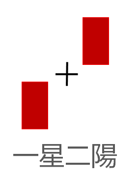
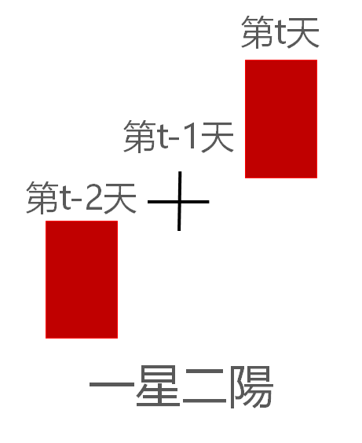

```{r setup, include=FALSE}
knitr::opts_chunk$set(echo=TRUE, message=FALSE, warning=FALSE, fig.align="center")
```

***

## 程式說明

在投資領域中，有些投資者認為技術分析線圖上若出現一星二陽的K棒組合，代表這支股票未來會有一波多頭的走勢。在這篇文章中，將以GOOGLE公司的歷史股價資料，示範如何以R軟體來回測驗證這個交易想法。若回測的交易日出現一星二陽K棒組合，則以當日的收盤價進場，出場則是在收盤價跌破20日移動平均線時，以跌破當日的收盤價出場。

```{r print kbar graph, echo=FALSE, out.height="250px", out.width="200px"}

```

***

## 需求套件

在這份範例程式碼中，主要會用到兩個套件：

1. [`quantmod`](https://cran.r-project.org/web/packages/quantmod/quantmod.pdf)：針對財務量化投資領域開發出的套件，在此份範例檔中，此套件將用來下載股價數據、計算技術指標以及繪圖分析。
2. [`dplyr`](https://cran.r-project.org/web/packages/dplyr/dplyr.pdf)：R軟體處理資料的利器，讓R軟體在處理資料時能夠更簡單且迅速。

```{r use package, eval=TRUE}
library(quantmod)
library(dplyr)
```

***

## 下載股價數據

首先利用`quantmod`套件內的`getSymbols()`函數來下載歷史股價資料。`getSymbols()`的`Symbols`引數要放入下載的股票代碼，`src`引數則是放入下載的資料庫來源。此處設定的資料庫來源是[Yahoo Finance](https://finance.yahoo.com/)，要下載的股票的代碼可從該網站取得。本次範例是以GOOGLE公司的股票價格資料進行分析，該公司在Yahoo Finance資料庫中的股票代碼是`GOOG`。

```{r download stock data, eval=TRUE}
googleStockCode <- "GOOG"
stockData <- getSymbols(Symbols=googleStockCode)
stockData <- get(stockData)
```

下載好的股價資料是以xts格式做儲存，資料依日期排序，資料欄位依序為開盤價、最高價、最低價、收盤價及成交量。資料期間為2007年01月03日到2017年11月14日，資料內容如下所示：

```{r show stock data}
# 呈現資料前10筆 
head(stockData,10)      
```

***

## 整理股價數據

為方便接下來的程式處理，我們對資料做以下處理：

1. 將資料由xts格式轉為tibble格式
2. 重新命名欄位
3. 將日期成為新的一個欄位
4. 將成交量為0及NA的交易日刪除

```{r arrange stock data, eval=TRUE}
# 將資料由xts格式轉為tibble格式  
stockData <- as_data_frame(stockData)

# 重新命名欄位
colnames(stockData) <- c("open", "high", "low", "close", "volume", "adjPrice") 

# 將日期成為新的一個欄位
stockData$date <- as.Date(row.names(stockData)) 

stockData <- stockData %>%
  
              # 重新編排欄位順序
              select(c(date,open:volume)) %>%
  
              # 將成交量為0的交易日刪除
              filter((volume>0)|(!is.na(volume)))                                
```

整理好的股價資料內容如下所示：

```{r show arrange stock data}
stockData 
```

***

## 判斷一星二陽K棒組合策略進場位置

在整理好資料後，以程式來判斷GOOGLE股票在歷史交易期間內，發生一星二陽K棒組合的位置。首先定義一星二陽K棒組合時間的發生點：

```{r print kbar graph time, echo=FALSE, out.height="250px", out.width="200px"}

```

一星二陽K棒組合可以下列9個條件來刻劃：

1. 第t天的收盤價 > 第t天的開盤價
2. 第t-2天的收盤價 > 第t-2天的開盤價
3. 第t天的開盤價 > 第t-1天的收盤價*(1-0.01)
4. 第t天的開盤價 < 第t-1天的收盤價*(1+0.01)
5. 第t-2天的收盤價 > 第t-1天的開盤價*(1-0.01)
6. 第t-2天的收盤價 < 第t-1天的開盤價*(1+0.01)
7. 第t天的實體K棒長度為1%以上
8. 第t-1天的實體K棒長度為0.5%以下
9. 第t-2天的實體K棒長度為1%以上

其中，實體K棒長度=|(當日收盤價/當日開盤價-1)|

由上述的條件可以知道，如果要刻劃一星二陽K棒組合，需要第t-2天到第t天的開盤價、收盤價和實體K棒長度。首先整理這些判斷條件所需的資料：

```{r condition prepare, eval=TRUE}
stockData <- stockData %>%
  
               mutate(
                 # 第t-1天收盤價
                 lagClose1=lag(close,1), 
                 
                 # 第t-2天收盤價
                 lagClose2=lag(close,2),
                 
                 # 第t-1天開盤價
                 lagOpen1=lag(open,1),
                 
                 # 第t-2天開盤價
                 lagOpen2=lag(open,2),
                 
                 # 第t天的實體K棒長度
                 kbarValue=abs(close/open-1), 
                 
                 # 第t-1天的實體K棒長度
                 lagKbarValue1=lag(kbarValue,1),
                 
                 # 第t-2天的實體K棒長度
                 lagKbarValue2=lag(kbarValue,2))   
```

判斷條件所需要的資料都準備好後，就可以找出GOOGLE股票在過去交易期間，發生過一星二陽K棒組合的時間點，這些時間點即是策略的進場點。

```{r find inSite, eval=TRUE}
inSiteTable <- stockData %>%
  
               filter(
                 # 第t天的收盤價 > 第t天的開盤價
                 close>open,
                 
                 # 第t-2天的收盤價 > 第t-2天的開盤價
                 lagClose2>lagOpen2, 
                 
                 # 第t天的開盤價 > 第t-1天的收盤價*(1-0.01)
                 open>lagClose1*(1-0.01),
                 
                 # 第t天的開盤價 < 第t-1天的收盤價*(1+0.01)
                 open<lagClose1*(1+0.01),
                 
                 # 第t-2天的收盤價 > 第t-1天的開盤價*(1-0.01)
                 lagClose2>lagOpen1*(1-0.01),
                 
                 # 第t-2天的收盤價 < 第t-1天的開盤價*(1+0.01)
                 lagClose2<lagClose1*(1+0.01),
                 
                 # 第t天的實體K棒長度為1%以上
                 kbarValue>0.01,
                 
                 # 第t-1天的實體K棒長度為0.5%以下
                 lagKbarValue1<0.005,
                 
                 # 第t-2天的實體K棒長度為1%以上
                 lagKbarValue2>0.01) %>%
  
               # 紀錄一星二陽K棒組合發生日及當日收盤價，並重新命名欄位
               select(inDate=date, buyPrice=close)         
```

在經過程式判斷後，可以看到在2007年01月03日到2017年11月14日這段期間，GOOGLE股票總共有發生過16次一星二陽K棒組合情況。

```{r show inSiteTable}
inSiteTable
```

***

## 判斷一星二陽K棒組合策略出場位置

在找到一星二陽K棒組合發生的進場點位置後，接下來要找出場點位置。首先整理GOOGLE股票在回測交易期間內，發生收盤價跌破20日移動平均線的位置。收盤價跌破20日移動平均線在程式中的判斷條件為：

1. t日的收盤價 < t日的20日移動平均線
2. t-1日的收盤價 > t-1日的20日移動平均線

此處利用[`TTR`](https://cran.r-project.org/web/packages/TTR/TTR.pdf)套件的`SMA()`函數來協助我們計算移動平均線。`TTR`套件在呼叫`quantmod`套件時就會一併啟用，所以不用額外再呼叫。

```{r find outSiteTable, eval=TRUE}
outSiteTable <- stockData %>%
  
                mutate(
                  
                  # 計算第t日的20日移動平均線
                  MA20=SMA(close, 20),
                  
                  # 計算第t-1日的20日移動平均線
                  lagMA20=lag(MA20,1)) %>% 
  
                filter(
                  
                  # t日的收盤價<t日的20日移動平均線
                  close<MA20,
                  
                  # t-1日的收盤價>t-1日的20日移動平均線
                  lagClose1>MA20) %>%
  
                # 紀錄收盤價跌破20日移動平均線的發生日及當日收盤價，並重新命名欄位
                select(outDate=date, sellPrice=close)  
```

透過上述程式判斷，即可找出GOOGLE股票跌破20日移動平均線的位置。從結果中發現，GOOGLE股票在2007年01月03號到2017年11月14號這段期間，發生過161次收盤價跌破20日移動平均線的情況。

```{r show outSiteTable}
outSiteTable
```

整理好Google公司進場位置表(inSiteTable)和出場位置表(outSiteTable)後，就可以整理策略的交易明細表。透過迴圈進場位置表，逐一尋找每個進場日後最近的出場日，並同時紀錄買進價格和賣出價格。

```{r find near outsite}
# 建立交易明細表
tradeDetailTable <- NULL   

for(ix in 1:nrow(inSiteTable)){
  
  # 目前的進場日期
  inDate <- inSiteTable$inDate[ix] 
  
  # 找尋進場日期往後最近的出場位置
  outSite <- which(outSiteTable$outDate>inDate)[1]  
  
  # 防呆機制，如果進場日期在資料尾端，有可能發生資料不足找不到出場位置的狀況
  if(length(outSite)>0){                            
    
    # 將該筆進場資訊與對應的出場資訊合併，並儲存至交易明細表內
    tradeDetailTable <- bind_rows(tradeDetailTable, bind_cols(inSiteTable[ix,], outSiteTable[outSite,]))
  }
}
```

整理好的交易明細表如下表所示，欄位依序為進場日期(inDate)、進場價格(buyPrice)、出場日期(outDate)及出場價格(sellPrice)。

```{r show tradeDetailTable}
tradeDetailTable
```

***

## 一星二陽K棒組合策略績效分析

整理好策略在回測期間內每筆交易的進場價格和出場價格，就可以計算每次交易的報酬率。含交易成本的報酬率算法為：

$Ret=P_s*(1-C_s)/(P_b*(1+C_b))-1$

其中，$P_b$和$P_s$分別為買入價格及賣出價格，$C_b$和$C_s$則是買入和賣出交易成本，此處買賣交易成本設定為千分之二。

除了報酬率以外，也需要觀察這個策略每次交易持有部位日數。在R軟體中，只要直接將兩個日期直接相減即可自動計算日數差距。

```{r compute ret and holdDays}

buyCostR <- 0.002   # 買入交易成本
sellCostR <- 0.002  # 賣出交易成本

tradeDetailTable <- tradeDetailTable %>%
  
                      mutate(
                        
                        # 計算報酬率
                        ret=sellPrice*(1-sellCostR)/(buyPrice*(1+buyCostR))-1,
                        
                        # 計算持有日數
                        holdDays=as.numeric(outDate-inDate))                    
```

計算報酬率和每次交易持有部位日數的交易明細表如下所示：

```{r show tradeDetailTable again}
tradeDetailTable
```

接下來可以分析一星二陽K棒組合交易策略應用在Google股票的歷史績效表現。

策略績效表現衡量的指標，大致上有：

1. 平均報酬率
2. 勝率
3. 交易次數
4. 報酬率標準差
5. 最大報酬率
6. 最小報酬率
7. 平均持有日數

上述的績效指標在程式中的寫法如下：

```{r performance analysis}
# 平均報酬率
meanRet <- mean(tradeDetailTable$ret)

# 報酬率標準差
sdRet <- sd(tradeDetailTable$ret) 

# 交易次數
tradeNums <- nrow(tradeDetailTable) 

# 勝率
winRatio <- sum(as.numeric(tradeDetailTable$ret>0))/tradeNums

# 最大報酬率
maxRet <- max(tradeDetailTable$ret)

# 最小報酬率
minRet <- min(tradeDetailTable$ret) 

# 平均持有日數
avgHoldDays <- mean(tradeDetailTable$holdDays)                 
```

計算好上述的績效指標後，可以整理成一個簡單的績效結果報表。

```{r show performance analysis}
cat(paste0("*********策略回測績效*********\n",
           "平均報酬率: ",round(meanRet*100,2)," %\n",
           "交易次數: ",tradeNums," 次\n",
           "勝率: ",round(winRatio*100,2)," %\n",
           "報酬率標準差: ",round(sdRet*100,2)," %\n",
           "最大報酬率: ",round(maxRet*100,2)," %\n",
           "最小報酬率: ",round(minRet*100,2)," %\n",
           "平均持有日數: ",round(avgHoldDays,2),"天"))
```

***

## 整理繪圖資料

在計算完整個策略的回測績效後，我們會隨機抽幾個交易明細表內的樣本(或者是觀察特定樣本)來繪圖。透過看圖的方式，來檢驗自己寫的程式碼判斷條件是否有需要做修正，或者是觀察是否有其他能夠提升交易策略獲利及勝率的條件。

在R軟體中，`quantmod`套件內有一個`chart_Series()`的繪圖函數，可以幫我們快速繪製技術分析圖形。在繪製圖形前，需要整理好要繪圖的資料表內容。

在一般的技術分析圖形中，通常會有5日移動平均線、20日移動平均線及60日移動平均線，為使得繪圖時能夠呈現這些均線的資訊，先在股價資料中新增這三個均線資料。

```{r add ma to stockData}
stockData <- stockData %>%
              mutate(
                MA5=SMA(close,5),     # 5日移動平均線
                MA20=SMA(close,20),   # 20日移動平均線
                MA60=SMA(close,60))   # 60日移動平均線    
```

在繪製技術分析圖形前，需要先指定要繪製的交易樣本。為了能夠觀察策略進出場前後的走勢狀況，繪製期間的起始日與結束日分別為進場前和出場後35個交易日。此外，為了能夠在技術分析圖形上標註交易樣本的進場點和出場點，需要新增進場點和出場點的欄位資訊。最後，為配合`chart_Series()`函數的格式要求，要將繪圖期間的資料由tibble格式轉回xts格式。

```{r plot data prepare}
# 繪製的交易樣本(在交易明細表列的位置)
plotSample <- 2   

# 繪製交易樣本的進出場日期
inDate <- tradeDetailTable$inDate[plotSample]
outDate <- tradeDetailTable$outDate[plotSample]

# 繪圖起始日(進場日前35個交易日)，此處用ifelse避免繪製資料超出邊界
matchSite <- which(stockData$date==inDate)-35
plotStartDate <- stockData$date[ifelse(matchSite<1, 1, matchSite)]                           
  
# 繪圖結束日(出場日後35個交易日)，此處用ifelse避免繪製資料超出邊界
matchSite <- which(stockData$date==outDate)+35
plotEndDate <- stockData$date[ifelse(matchSite>nrow(stockData), nrow(stockData), matchSite)]
  
# 整理繪製的股價資料期間範圍及欄位資料
plotData <- stockData[which((stockData$date>=plotStartDate)&(stockData$date<=plotEndDate)),]

# 取出繪圖資料所需的欄位
plotData <- plotData %>% select(date:volume, MA5:MA60)
  
# 加入進場位置欄位資訊，用於繪圖時標註進場點位
plotData$inSite <- rep(NA, nrow(plotData))
plotData$inSite[which(plotData$date==inDate)] <- plotData$open[which(plotData$date==inDate)]*0.97
  
# 加入出場位置欄位資訊，用於繪圖時標註出場點位
plotData$outSite <- rep(NA, nrow(plotData))
plotData$outSite[which(plotData$date==outDate)] <- plotData$close[which(plotData$date==outDate)]*1.03
  
# 將plotData資料由tibble格式轉為xts格式，符合chart_Series繪圖格式要求
plotData <- xts(plotData[,-1], order.by= plotData$date)
```

***

## 繪製技術分析圖形

整理好繪圖資料(plotData)後，我們即可用`chart_Series()`函數來繪製技術分析圖形。由於`chart_Series()`函數繪製的K棒顏色並非我們所習慣的紅K棒和黑K棒，所以要先設定繪製的K棒顏色。

執行`chart_Series()`函數會繪製每個交易日的K棒圖形(主圖)，接下來透過`add_Vo()`及`add_TA()`來進行疊圖。

`chart_Series(x, name, theme)`：繪製每個交易日的K棒圖形(主圖)。

* x: xts格式資料，資料欄位需依序為開盤價、最高價、最低價、收盤價及成交量，資料列則為日期
* name: 繪圖的標題名稱
* theme: 技術分析繪製主題，可調整K棒呈現的顏色等設定

`add_Vo()`：在K棒圖形底下加入各交易日的成交量資訊。

`add_TA(x, on, type, col, lwd,  pch, cex)`：在繪製好的圖形上加入各種技術線型或點位。

* x: 技術線型或點位資料
* on: 資料要繪製在第幾個圖形上，以此範例來說，on=1會疊在K棒圖形上，on=2則是疊在成交量圖形上
* type: 繪製要線型(`l`)還是點位(`p`)
* col: 繪製的顏色，R的顏色代碼可參考此[連結](http://www.stat.columbia.edu/~tzheng/files/Rcolor.pdf)
* lwd: 控制線或點外框的粗度
* pch: 控制點的圖形，可參考此[連結](http://www.sthda.com/sthda/RDoc/figure/graphs/r-plot-pch-symbols-points-in-r.png)
* cex: 控制點的大小

```{r plot chart_Series}

# 設定K棒顏色
myTheme <- chart_theme()
myTheme$col$dn.col <- c("chartreuse3")  # 跌的K棒顏色
myTheme$col$up.col <- c("firebrick3")   # 漲的K棒顏色
  
# 繪製各交易日的K棒圖形(主圖)
chart_Series(x=plotData[,1:5], name=paste0(googleStockCode," 技術分析圖形"), theme=myTheme)

# 加入成交量圖形
add_Vo()

# 加入5日移動平均線
add_TA(x=plotData$MA5, on=1, type="l", col="blue", lwd=1.5)

# 加入20日移動平均線
add_TA(x=plotData$MA20, on=1, type="l", col="orange", lwd=1.5)

# 加入60日移動平均線
add_TA(x=plotData$MA60, on=1, type="l", col="green", lwd=1.5)

# 標註進場位置
add_TA(x=plotData$inSite, on=1, type="p", col="red", pch=2, cex=5, lwd=1.5)

# 標註出場位置
add_TA(x=plotData$outSite, on=1, type="p", col="green", pch=6, cex=5, lwd=1.5)

```

在技術分析圖形中，紅色上三角形為一星二陽K棒組合的進場位置，綠色下三角形則為出場位置。透過這張圖，可以直接判斷我們的程式在辨識K棒組合的條件是否合理，有沒有需要做修改。此外，也可以判斷我們的出場位置是否合理，從這張圖來看，出場的位置其實並沒有很好，有在做改進的空間。

此處只要修改plotSample變數，重跑繪圖程式碼即可繪製新的圖形出來進行觀察。為了方便，可以將繪圖程式碼包成一個函數，這樣只要修改引數即可繪製新的圖形。舉例來說，將上面繪圖程式碼包裝成函數：

```{r plot function}

PlotGraph <- function(plotSample){

# 繪製交易樣本的進出場日期
inDate <- tradeDetailTable$inDate[plotSample]
outDate <- tradeDetailTable$outDate[plotSample]

# 繪圖起始日(進場日前35個交易日)，此處用ifelse避免繪製資料超出邊界
matchSite <- which(stockData$date==inDate)-35
plotStartDate <- stockData$date[ifelse(matchSite<1, 1, matchSite)]                           
  
# 繪圖結束日(出場日後35個交易日)，此處用ifelse避免繪製資料超出邊界
matchSite <- which(stockData$date==outDate)+35
plotEndDate <- stockData$date[ifelse(matchSite>nrow(stockData), nrow(stockData), matchSite)]
  
# 整理繪製的股價資料期間範圍及欄位資料
plotData <- stockData[which((stockData$date>=plotStartDate)&(stockData$date<=plotEndDate)),]
plotData <- plotData %>% select(date:volume, MA5:MA60)
  
# 加入進場位置欄位資訊
plotData$inSite <- rep(NA, nrow(plotData))
plotData$inSite[which(plotData$date==inDate)] <- plotData$open[which(plotData$date==inDate)]*0.95
  
# 加入出場位置欄位資訊
plotData$outSite <- rep(NA, nrow(plotData))
plotData$outSite[which(plotData$date==outDate)] <- plotData$close[which(plotData$date==outDate)]*1.05
  
# 將plotData資料由tibble格式轉為xts格式，符合chart_Series繪圖格式要求
plotData <- xts(plotData[,-1], order.by= plotData$date)

# 設定K棒顏色
myTheme <- chart_theme()
myTheme$col$dn.col <- c("chartreuse3")  # 跌的K棒顏色
myTheme$col$up.col <- c("firebrick3")   # 漲的K棒顏色
  
# 繪製主圖形
pic <- chart_Series(x=plotData[,1:5], name=paste0(googleStockCode," 技術分析圖形"), theme=myTheme)

# 加入成交量圖形
pic <- add_Vo()

# 加入5日移動平均線
pic <- add_TA(x=plotData$MA5, on=1, type="l", col="blue", lwd=1.5)

# 加入20日移動平均線
pic <- add_TA(x=plotData$MA20, on=1, type="l", col="orange", lwd=1.5)

# 加入60日移動平均線
pic <- add_TA(x=plotData$MA60, on=1, type="l", col="green", lwd=1.5)

# 標註進場位置
pic <- add_TA(x=plotData$inSite, on=1, type="p", col="red", pch=2, cex=5, lwd=1.5)

# 標註出場位置
pic <- add_TA(x=plotData$outSite, on=1, type="p", col="green", pch=6, cex=5, lwd=1.5)

return(pic)
}

```

使用建立好的`PlotGraph()`函數，只要更改plotSample的值，即可馬上繪圖出來。從圖形中來看，程式確實都有捕捉到一星二陽K棒組合，且出場點皆為收盤價跌破20日移動平均線。

```{r show function plot}
PlotGraph(plotSample=5)
PlotGraph(plotSample=11)
PlotGraph(plotSample=16)
```

***

## 結語

在這份程式碼範例中，我們呈現如何將R軟體應用在財務投資上。透過一個簡單的程式回測框架，驗證投資人常用的一星二陽K棒組合策略，是否能在Google股票過去的交易期間獲利。此外，也示範如何用R軟體繪製技術分析圖形，透過圖形視覺化讓策略更加容易分析和改善。


